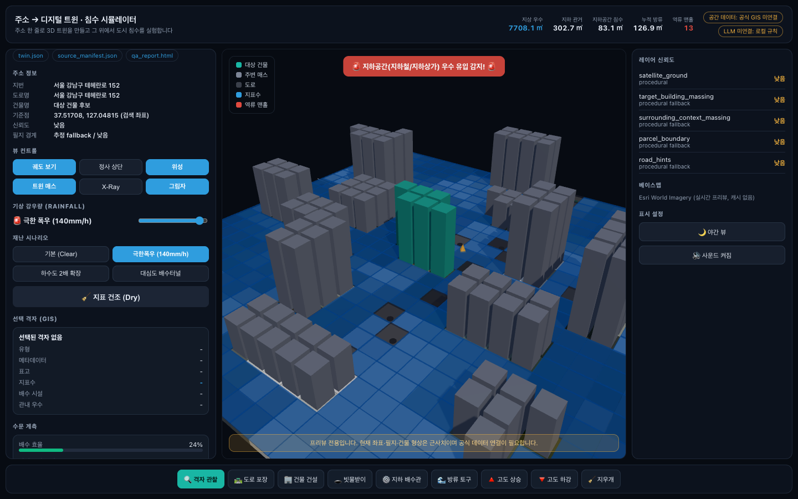
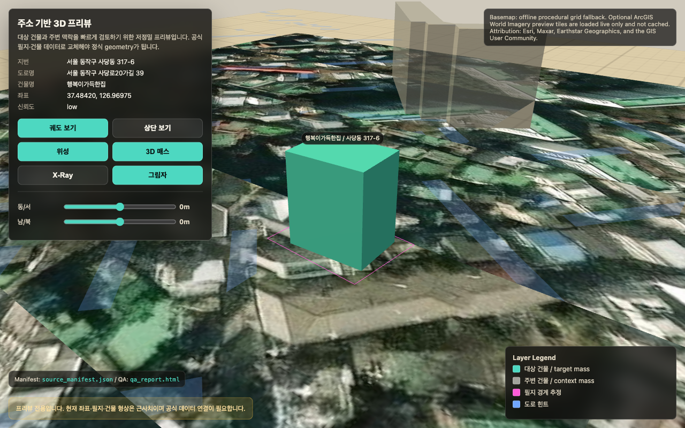
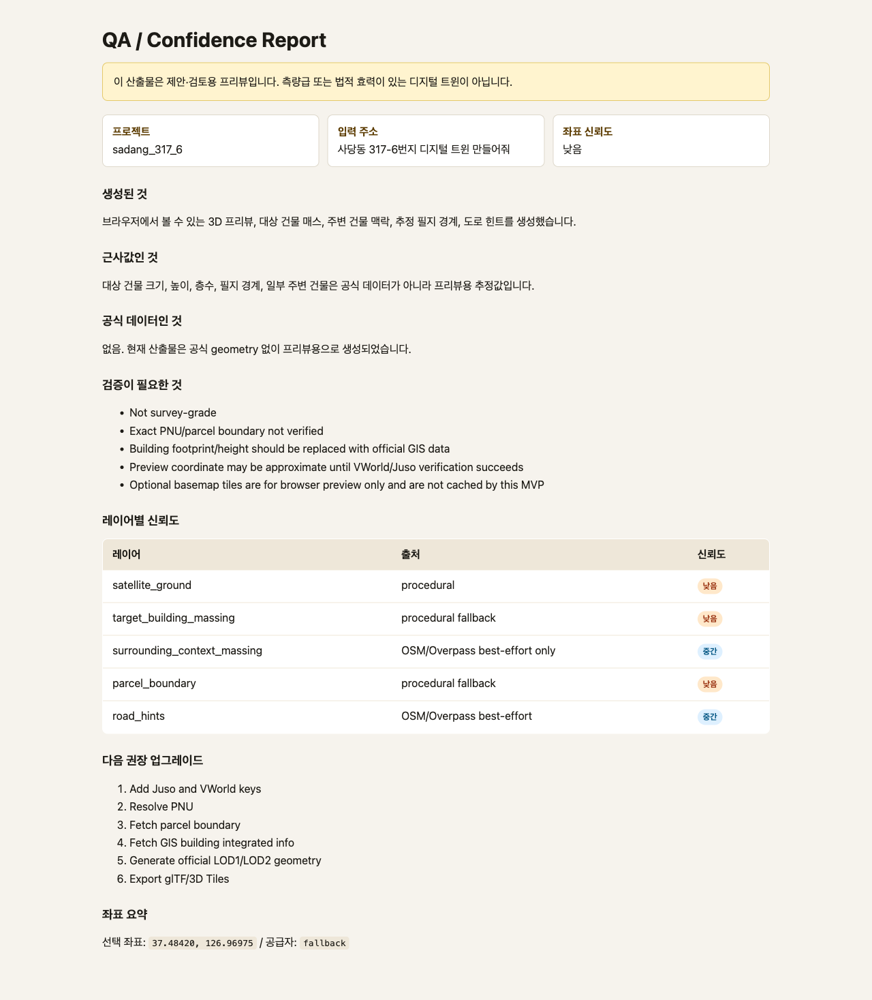

# Address → Digital Twin · Flood Simulator

[](https://github.com/VincentChoi33/address-to-digital-twin-mvp/actions/workflows/ci.yml)
[](LICENSE)

Type a Korean address, get a real-data 3D digital twin — actual DEM terrain, actual WFS building footprints, full-resolution satellite drape — then run a **GPU shallow-water flood simulation** on it: continuous water surface with fresnel reflections, storm drains along the real roads, manhole backflow when the network saturates. TypeScript + Three.js + Vite.

**One flow, end to end:** `주소 → Juso/VWorld 지오코딩 → WFS 실건물·도로 + 실DEM + 위성 → GPU 수문 격자 베이크 → virtual-pipe-model 침수 해석`. Any address works — keyless/offline runs degrade to deterministic preview twins, so the loop never breaks.

**NVIDIA/Omniverse track:** the app now exports each twin as OpenUSD (`*.usda`) with an NVIDIA stack manifest, SimReady minimum report, USD PhysicsScene/static-collider baseline, ovrtx viewer wrapper, first-frame smoke script, ovrtx→ovstream WebRTC readiness smoke server, NVIDIA `@nvidia/ov-web-rtc` Direct browser client, runtime preflight, GPU-host handoff manifest, a self-contained SimReady validator asset source, and an ovstream/WebRTC viewer contract that forbids browser-side USD rendering as final NVIDIA evidence. The committed Sadang sample includes a generated Omniverse package under `src/samples/sadang_317_6/omniverse/`; local `usdchecker` validation passes, `simready-validate 2026.4.9` passes `Prop-Robotics-Neutral@1.0.0` on the self-contained asset-source copy, and a remote `train1` RTX 3090 host produced a real NVIDIA ovrtx LdrColor first frame, ovrtx→ovstream WebRTC server readiness, and browser `@nvidia/ov-web-rtc` Direct video first-frame evidence.



| Static preview export (Sadang sample) | Generated QA / confidence report |
| :---: | :---: |
|  |  |

## What it does

**1. Address → twin pipeline** (`src/core/`, runs in Node and in the browser)

*(the deployed `/api/agent` adds VWorld WFS: real parcel-anchored footprints with heights/floors — e.g. 강남파이낸스센터 33-vertex footprint, 202m/45F)*

- Normalizes a raw Korean address request into parcel / road / building-name candidates.
- Geocodes through a graceful fallback chain: Juso → VWorld → Nominatim → deterministic offline coordinates (Node CLI), or straight to the offline path in the browser.
- Generates target massing, surrounding context (OSM/Overpass best-effort, seeded procedural fallback), parcel boundary, and road hints.
- Emits core artifacts: `twin.json`, `source_manifest.json` (per-layer source + confidence), human-readable `qa_report.html`, standalone `preview.html`.
- Emits NVIDIA artifacts: `omniverse.usda`, `nvidia_stack_manifest.json`, and `simready_minimum_report.json`. The committed sample additionally packages an ovrtx viewer/session wrapper, GPU-host first-frame smoke script, ovstream smoke server, and NVIDIA `@nvidia/ov-web-rtc` browser client with a first-frame probe.

**2. GPU flood solver** (`src/water/`)

- **Virtual pipe model** (Mei et al.) integrated entirely on the GPU: half-float ping-pong textures, per-cell flux to 4 neighbours from hydraulic head, rainfall source, capacity-limited storm-drain sinks, open boundary.
- Static inputs baked deterministically on the CPU (`bake.ts`, unit-tested): real DEM + extruded building obstacles as the solid heightfield, drain inlets every 18m along the real road centerlines, network capacity → manhole backflow loop.
- Continuous water-surface shader: depth-based absorption (shallow teal → muddy deep), fresnel sky reflection, sun glint, depth-weighted foam. No blue boxes.
- Stylized demo physics (rainfall amplified ×200 in one constant), not SWMM.

**3. Real-data scene** (`src/scene/`)

- Terrain from **AWS Terrain Tiles** DEM with a DSM→DTM cleanup (morphological erosion + blur — the ALOS source carries tower clusters as 100m fake hills, and ocean pixels are bathymetry) and z18–19 satellite drape.
- Real WFS/OSM **building footprints extruded** with ring sanitization; physical sky + cube environment driving PBR and water reflections; rain streaks; ACES tone mapping.
- Disaster scenario presets (집중호우 80mm/h, 극한폭우 140mm/h, 대심도 배수터널), rainfall slider, point inspector, network-load gauge, rolling hydrograph, synthesized sound (Web Audio).
- **Graceful degradation:** if WebGL is unavailable the app keeps running in console mode — address analysis and artifact downloads still work, with a clear banner instead of a dead page.
- LLM-style console: a deterministic local rule agent works fully offline; in deployment `/api/agent` can call an Ollama-compatible Gemma endpoint and the client falls back to the local agent when the server is absent.

> **Not** a survey-grade, cadastral, legal, BIM, or legally authoritative digital twin. Official PNU/parcel/building geometry must replace the preview massing before any production or decision-grade use.

## Quick start

```bash
npm install
npm run dev     # open the printed URL
```

Try any Korean address in the console:

```text
사당동 317-6번지 디지털 트윈 만들어줘          # curated sample
서울 강남구 테헤란로 152 디지털 트윈 프리뷰    # generated offline, on the spot
부산 해운대구 우동 1408                        # also works — different terrain, same flow
```

Then hit **극한폭우 (140mm/h)** and watch the twin flood: water sheets down the real terrain, ponds in the real low streets, the drain network saturates, and manholes start backflowing.

CLI generation (adds Juso/VWorld/Nominatim/Overpass when keys/network exist):

```bash
npx tsx src/core/runAddressTwin.ts --address "서울 강남구 테헤란로 152"
```

Generate the committed NVIDIA Omniverse package for the Sadang sample:

```bash
npm run nvidia:package
npm run nvidia:simready        # requires simready-validate + SimReady Foundation
# or: npm run nvidia:simready:auto  # auto-installs validator and auto-clones Foundation
npm run nvidia:content-agents:check  # records blocked gate until NVIDIA endpoints/auth exist
# with Content Agents endpoints/auth: npm run nvidia:content-agents
usdchecker src/samples/sadang_317_6/omniverse/sadang_317_6.usda
```

## Commands

| Command | What it does |
| --- | --- |
| `npm run dev` | local web app (Vite) |
| `npm run build` | typecheck + production build |
| `npm test` | unit tests (Vitest) |
| `npm run lint` | TypeScript check |
| `npm run sample:sadang` | regenerate Sadang sample artifacts |
| `npm run export:omniverse` | generate OpenUSD + NVIDIA stack/SimReady reports for the Sadang sample |
| `npm run nvidia:preflight` | probe local NVIDIA/Omniverse/SimReady runtime gates and write preflight reports |
| `npm run nvidia:handoff` | write GPU-host runbook + SHA-256 handoff manifest from an already-generated package |
| `npm run nvidia:validate` | verify the generated NVIDIA package: SHA inventory, USD physics/material/unit gates, preflight ovstream gate, and viewer no-WebGL contract |
| `npm run nvidia:package` | export OpenUSD, run preflight, write the handoff package, then run package validation |
| `npm run nvidia:simready` | run formal SimReady profile validation on `simready_asset/.../sadang_317_6.usda` when `simready-validate` + SimReady Foundation are available |
| `npm run nvidia:simready:auto` | CI/dev convenience: auto-install `simready-validate` and auto-clone NVIDIA SimReady Foundation before validation |
| `npm run nvidia:content-agents` | run NVIDIA Content Agents Material→Physics assignment when real endpoints/auth are configured |
| `npm run nvidia:content-agents:check` | write a blocked-gate report without faking Content Agents success when endpoints/auth are missing |
| `npm run prepare:deploy` | build `dist/` + copy samples for deployment |

## Project structure

```text
src/
  core/              # address → twin generation (Node + browser-safe)
  scene/             # terrain (DEM+satellite), buildings (WFS extrude), sky, rain, viewer
  water/             # GPU pipe-model solver, water surface shader, CPU bake (+tests)
  nvidia/            # OpenUSD/Omniverse/SimReady package exporter
  app/               # UI shell + agent console + scenario/stats wiring
  render/            # basemap mosaic loader, Web Audio synth
  types/twin.ts      # shared twin/manifest types
  samples/           # committed Sadang sample artifacts
nvidia-viewer/        # standalone NVIDIA ov-web-rtc Direct browser client
deploy/
  server.py          # static + /api/agent (VWorld WFS + Ollama/Gemma) + tile proxy
```

## Deployment with a local model server

```bash
npm run prepare:deploy
python3 deploy/server.py        # HOST/PORT/OLLAMA_URL/GEMMA_MODEL via env or .env
```

`deploy/server.py` serves the built app and exposes `/api/agent` (Gemma via Ollama, `gemma3:4b` default) plus the VWorld tile proxy. The browser falls back to its local agent whenever the server or model is unavailable.

Batch QA on a deployed server:

```bash
python3 deploy/batch_address_qa.py addresses.txt --project-id address_batch_20260427
```

## Optional environment

Runs with **zero keys** out of the box (offline deterministic coordinates). Keys only raise fidelity:

```bash
cp .env.example .env
```

| Variable | Purpose |
| --- | --- |
| `VWORLD_API_KEY` | VWorld geocoder + WMTS satellite tiles (key stays server-side) |
| `JUSO_API_KEY` | Juso address normalization (derived summary only is persisted) |
| `NOMINATIM_USER_AGENT` | occasional manual fallback tests only, not bulk geocoding |
| `VITE_BASEMAP_MODE` | empty(=arcgis) \| `procedural` \| `vworld` \| `arcgis` \| `custom` |
| `VITE_CUSTOM_TILE_URL` | e.g. `https://host/{z}/{x}/{y}.png` |

## Spatial alignment principle

Geocoding is a search hint, not the world origin:

1. Normalize/search the address with Juso/VWorld.
2. Use the search coordinate only to fetch candidate WFS parcel/building/road geometry.
3. When official WFS parcel geometry exists, re-anchor the local meter frame to the official parcel centroid; else to the official building footprint centroid.
4. Satellite imagery is draped as preview texture onto that frame — never used to infer legal geometry.

## NVIDIA Omniverse export

The NVIDIA path is documented in [`docs/nvidia-omniverse-migration.md`](docs/nvidia-omniverse-migration.md).

Current implemented package:

```text
src/samples/sadang_317_6/omniverse/
  sadang_317_6.usda
  sadang_317_6.ovrtx_viewer.usda
  nvidia_ovrtx_first_frame.py
  nvidia_ovstream_smoke_server.py
  ovstream_browser_client/      # includes scripts/probe-first-frame.mjs
  nvidia_stack_manifest.json
  nvidia_runtime_preflight.json
  nvidia_runtime_preflight.md
  simready_minimum_report.json
  simready_asset/sadang_317_6/simready_usd/
  handoff_manifest.json
  NVIDIA_GPU_HOST_RUNBOOK.md
  ovstream_viewer_contract.json
  OVSTREAM_VIEWER_RUNBOOK.md
  usdchecker_report.txt
  README.md
```

The USD stage is authored as meter-based, Y-up OpenUSD with `MaterialBindingAPI`, `UsdPreviewSurface` materials, a USD `PhysicsScene`, conservative `PhysicsCollisionAPI` static colliders for terrain/buildings/roads/parcel geometry, `PhysicsMassAPI` building rigid bodies, official building meshes, road ribbons, parcel boundary, terrain reference, and flood-water reference layer. The ovrtx wrapper sublayers that source stage and adds NVIDIA viewer-owned Camera → RenderProduct → RenderVar → RenderSettings wiring. Remote `train1` evidence under [`docs/evidence/`](docs/evidence/) proves GPU/Docker/NVIDIA Container Toolkit/OpenUSD Python/Python ovrtx/Python ovstream/package-validation gates, a real 1280×720 ovrtx LdrColor first frame, ovrtx→ovstream server readiness (`/healthz` 503→200 after BGRA CUDA conversion), and an actual browser `@nvidia/ov-web-rtc` Direct video first frame (`videoWidth=1280`, `videoHeight=720`, `readyState=4`). Local SimReady evidence under [`docs/evidence/nvidia-simready-validate-sadang-2026-06-12.md`](docs/evidence/nvidia-simready-validate-sadang-2026-06-12.md) proves `Prop-Robotics-Neutral@1.0.0` validation on the self-contained asset-source copy. The remaining NVIDIA-only gate is captured in `docs/evidence/nvidia-content-agents-simready-readiness-2026-06-12.md`: provide NVIDIA/NGC/NVCF credentials or healthy Content Agents endpoints, run `npm run nvidia:content-agents`, then revalidate with `npm run nvidia:simready`.

## Data source policy

- Default ground is fully offline; satellite tiles (VWorld/ArcGIS/custom) are live preview-only with attribution and **no caching or persistence**.
- Juso/VWorld raw responses are never persisted — only derived summaries in `source_manifest.json`.
- Nominatim: occasional manual fallback only, custom User-Agent, 1 req/sec.
- Overpass/OSM context is best-effort; on failure, seeded procedural context is generated.
- Overture Maps remains a future connector placeholder (no dataset downloads).

## Testing & CI

Vitest covers the deterministic core: address normalization, offline twin generation, massing, manifest/QA building (incl. XSS escaping), OpenUSD/Omniverse export, and the hydrology bake/solver surfaces. GitHub Actions runs typecheck → tests → build → offline sample smoke on every push/PR.

## Upgrade path

1. Juso/VWorld keys → coordinate confidence.
2. PNU resolution → official cadastral parcel boundary.
3. GIS building integrated info → replace procedural massing with official footprints/heights.
4. DEM-backed terrain for the flood grid (replace seeded slope with real elevation).
5. AI3DAP/SolidRecon adapter → higher-detail roof/mesh/texture geometry.
6. OpenUSD/Omniverse export → NVIDIA RTX/SimReady validation path.
7. 3D Tiles/Cesium export → web-scale city viewing.

## License

[MIT](LICENSE)
