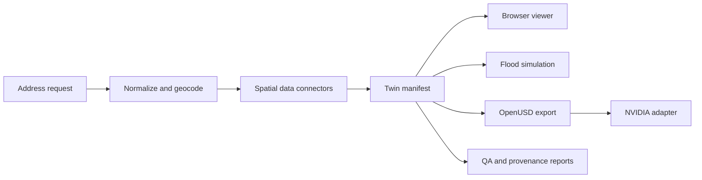

# Architecture

The project has one deterministic core and two optional deployment surfaces.

## Core boundaries

| Area | Responsibility | Network required |
| --- | --- | --- |
| `src/core/` | address normalization, source selection, deterministic fallback, manifest generation | No |
| `src/scene/` | terrain, building, road, parcel, and browser scene composition | Optional |
| `src/water/` | deterministic input bake and browser flood solver | No |
| `src/nvidia/` | OpenUSD export, package metadata, and NVIDIA handoff contracts | No for packaging |
| `deploy/` | optional API proxy and model-server integration | Yes |
| `nvidia-viewer/` | optional NVIDIA ovstream browser client | Yes |

## Golden path

1. Normalize an address request.
2. Resolve public data when credentials and network access are available.
3. Fall back to deterministic procedural inputs when they are not.
4. Write `twin.json`, `source_manifest.json`, and QA artifacts.
5. Render the browser twin and run the preview flood simulation.
6. Optionally export the same manifest to OpenUSD and package NVIDIA handoff artifacts.

The browser preview, OpenUSD package validation, and real GPU execution are
separate validation levels. A successful local package build does not claim
that RTX, ovstream, or external Content Agents services were exercised.

## Generated artifacts

`src/samples/sadang_317_6/` is a committed golden sample. Files under its
`omniverse/` directory are generated from the source manifest. Canonical
scripts live under `scripts/` and `src/nvidia/`; generated copies are included
only to make the GPU-host handoff self-contained.

Run `npm run nvidia:package` to regenerate and validate the package. The
command sanitizes machine-specific paths before computing the handoff hashes.
