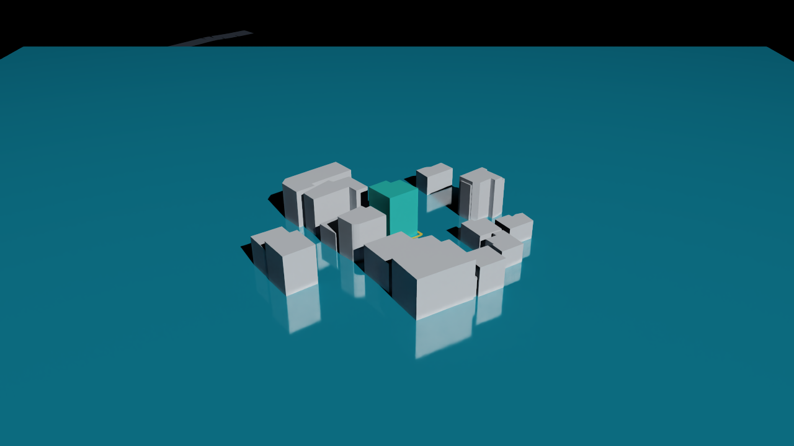
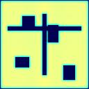

# NVIDIA-only Omniverse migration track

This repository now has a concrete NVIDIA-targeted export path in addition to the browser MVP.
The browser/Three.js viewer remains useful for fast local iteration, but the NVIDIA-only target is:

```text
Juso/VWorld/WFS twin.json
  → OpenUSD stage
  → NVIDIA Omniverse / RTX Renderer / ovrtx viewer
  → NVIDIA Warp / CUDA shallow-water smoke
  → authored SimReady profile validation
  → optional Omniverse Content Agents material + physics assignment
  → Omniverse Asset Validator / USD Performance Tuning
  → optional cuOpt / NuRec / AI-Q layers
```

## Implemented in this repo

- `src/nvidia/usd.ts`
  - Converts `TwinProject + SourceManifest` to an OpenUSD ASCII stage.
  - Authors `metersPerUnit = 1`, `upAxis = "Y"`, `defaultPrim`, `UsdPreviewSurface` materials, `MaterialBindingAPI`, a USD `PhysicsScene`, conservative `PhysicsCollisionAPI` static-collider semantics for terrain/buildings/roads/parcel geometry, official building meshes, official road ribbons, parcel boundary ribbon, terrain reference plane, and flood-water reference layer.
- `src/nvidia/exportOmniversePackage.ts`
  - Writes a deterministic package under `src/samples/sadang_317_6/omniverse/`.
  - Probes local NVIDIA/USD runtime gates.
  - Runs `usdchecker` when available and writes `usdchecker_report.txt`.
- `src/nvidia/ovrtxComposite.ts`
  - Generates `sadang_317_6.ovrtx_viewer.usda`, a viewer/session wrapper that sublayers the source OpenUSD stage and adds NVIDIA ovrtx Camera → RenderProduct → RenderVar → RenderSettings wiring.
- `scripts/nvidia_ovrtx_first_frame.py`
  - GPU-host smoke test that uses NVIDIA ovrtx `Renderer(RendererConfig(...))`, steps `/Render/OVServer/ViewportTexture0`, maps `LdrColor`, and saves JSON + image evidence.
- `scripts/nvidia_ovstream_smoke_server.py`
  - GPU-host smoke server that uses ovrtx CUDA `LdrColor`, converts RGBA8 to a persistent BGRA8 Warp CUDA buffer, starts `ovstream.Server(ServerType.WEBRTC)`, and gates `/healthz` on the first converted frame.
- `scripts/nvidia_warp_flood_smoke.py`
  - GPU-host NVIDIA Warp/CUDA shallow-water smoke. It launches a `@wp.kernel` virtual-pipe-style update over deterministic terrain/building/drain masks and writes `warp_flood_report.json` plus `warp_flood_depth.pgm`; with `--allow-missing` it records a blocked gate instead of faking success.
- `scripts/nvidia_content_agents_deploy_audit.py`
  - Read-only Content Agents deployment prerequisite audit. It checks GPU visibility, Docker/Compose daemon access, NVIDIA Container Toolkit via `docker run --gpus all`, official NVIDIA `content-agents` deployment skill checkout, service ports, `/health` endpoints, and redacted provider credentials without starting containers or printing secret values.
- `scripts/nvidia_content_agents_deploy.py`
  - NVIDIA-only deployment bridge for the official upstream Content Agents Docker Compose stacks. It writes ignored runtime compose/env files, requires `NVIDIA_API_KEY` before `up`, remaps Material/Physics to `8100/8200` plus separate OVRTX sidecars on `8101/8201`, auto-pins the two OVRTX sidecars to different GPUs on multi-GPU hosts, writes `.tmp/nvidia-content-agents/endpoints.env`, and outputs the exact `npm run nvidia:content-agents` / `npm run nvidia:simready` follow-up commands.
- `scripts/nvidia_acceptance.py`
  - Aggregates the NVIDIA-only acceptance certificate from committed package/evidence artifacts. It passes OpenUSD/package, no-WebGL ovstream viewer contract, ovrtx first frame, ovstream server/browser first frame, NVIDIA Warp/CUDA flood, and SimReady validator gates, and keeps the overall status blocked until real Content Agents Material→Physics assignment is present.
- `scripts/nvidia_finish.py`
  - One-shot finalizer for the remaining NVIDIA-only chain. It plans/checks/deploys Content Agents when credentials exist, waits for endpoints, avoids calling dead generated endpoints before health is ready, runs Material→Physics assignment, reruns SimReady, then reruns the acceptance certificate.
- `scripts/nvidia_remote_finish.py`
  - SSH GPU-host wrapper for the one-shot finalizer. It updates/clones the repo on `train1`-style NVIDIA hosts, reports only credential/endpoint presence, runs `nvidia:finish`, retries evidence copy-back, and supports remote key-file/endpoint arguments without printing secret values.
- `nvidia-viewer/`
  - Standalone NVIDIA `@nvidia/ov-web-rtc` Direct-mode browser client. Its rendered surface is only `video#remote-video`; it contains no browser-side USD/WebGL renderer. It includes `scripts/probe-first-frame.mjs` for Playwright video-dimension/screenshot evidence.
- `src/nvidia/preflight.ts` and `src/nvidia/runPreflight.ts`
  - Probes the true NVIDIA-only runtime gates: `nvidia-smi`, Docker daemon, NVIDIA Container Toolkit, USD Python/usdchecker, Omniverse/ovrtx/Kit viewer, NVIDIA Warp/CUDA, and Content Agents credentials/endpoints.
  - Writes `nvidia_runtime_preflight.json` and `.md` with redacted environment state and remediation.
- `src/nvidia/handoff.ts` and `src/nvidia/packageHandoff.ts`
  - Writes `handoff_manifest.json` with SHA-256 checksums for the USD package, source `twin.json`, and `source_manifest.json`.
  - Writes `NVIDIA_GPU_HOST_RUNBOOK.md` so a GPU host can reproduce the NVIDIA runtime gates without accepting browser WebGL evidence as a substitute.
- `src/nvidia/viewerContract.ts`
  - Writes `ovstream_viewer_contract.json` and `OVSTREAM_VIEWER_RUNBOOK.md`.
  - Defines the browser replacement path as NVIDIA ovstream/WebRTC video from an Omniverse RTX / ovrtx server. Client-side WebGL/Three.js/Babylon/glTF rendering is explicitly forbidden as final NVIDIA-only acceptance evidence.
- `src/nvidia/packageValidator.ts` and `src/nvidia/validatePackage.ts`
  - `npm run nvidia:validate` checks the generated package after handoff: SHA-256 inventory, USD units/material/physics semantics, preflight `OMNIVERSE.OVSTREAM.001` and `NVIDIA.WARP_FLOOD.001`, the Warp flood kernel artifact, and the viewer no-WebGL contract.
- Web app artifact links
  - Every generated twin now exposes `omniverse.usda`, `nvidia_stack_manifest.json`, and `simready_minimum_report.json` as downloadable blobs.

## Generated Sadang package

```text
src/samples/sadang_317_6/omniverse/
  sadang_317_6.usda
  sadang_317_6.ovrtx_viewer.usda
  nvidia_ovrtx_first_frame.py
  nvidia_ovstream_smoke_server.py
  nvidia_warp_flood_smoke.py
  ovstream_browser_client/      # includes scripts/probe-first-frame.mjs
  nvidia_stack_manifest.json
  nvidia_runtime_preflight.json
  nvidia_runtime_preflight.md
  simready_minimum_report.json
  simready_asset/sadang_317_6/simready_usd/
  handoff_manifest.json
  NVIDIA_GPU_HOST_RUNBOOK.md
  ovstream_viewer_contract.json
  OVSTREAM_VIEWER_RUNBOOK.md
  usdchecker_report.txt
  README.md
```

Current generated evidence:

- 17 official building meshes.
- 8 official road meshes.
- Official parcel boundary ribbon.
- Meter-based Y-up OpenUSD stage.
- USD `PhysicsScene` plus 27 static collision-enabled terrain/building/road/parcel meshes; 17 building rigid bodies carry `PhysicsMassAPI`/`physics:mass`; the flood-water reference plane remains non-colliding.
- Local `usdchecker` exit code 0 (`Validation Result ... Success!`).
- ovrtx wrapper USD validates with local `usdchecker` after adding root `metersPerUnit`, `upAxis`, and `defaultPrim` metadata.
- GPU-host handoff manifest status is `ready_for_gpu_host` with SHA-256 inventory.
- ovstream viewer contract status is `contract_authored_runtime_gated`: the browser viewer contract, GPU-host smoke server, and browser first-frame probe are authored.
- NVIDIA Warp flood smoke is authored, package-validated, and passed on `train1` with NVIDIA Warp 1.14.0 on CUDA (`max_depth_m=0.1577`, `flooded_area_m2_gt_10cm=147019.7`).
- Local package validator status is `passed` after `npm run nvidia:package`.
- Runtime preflight status is `openusd_ready`: local OpenUSD/usdchecker and Docker are present, but local NVIDIA GPU, Omniverse/ovrtx/Kit viewer, NVIDIA Warp/CUDA, Content Agents Material/Physics endpoints or deployment auth, and NVIDIA Container Toolkit gates are not ready on this Mac.
- RTX first-frame rendering, ovstream server readiness, browser `@nvidia/ov-web-rtc` Direct video first-frame decode, and NVIDIA Warp/CUDA flood smoke are proven on `train1`; local `simready-validate 2026.4.9` now passes `Prop-Robotics-Neutral@1.0.0` on the self-contained asset-source copy; Content Agents material/physics assignment remains the external NVIDIA credential/service gate.

Remote GPU evidence captured on 2026-06-12 and 2026-06-13:

- [`docs/evidence/nvidia-train1-runtime-preflight-2026-06-12.md`](evidence/nvidia-train1-runtime-preflight-2026-06-12.md)
- [`docs/evidence/nvidia-train1-runtime-preflight-2026-06-12.json`](evidence/nvidia-train1-runtime-preflight-2026-06-12.json)
- [`docs/evidence/nvidia-train1-package-validation-2026-06-12.md`](evidence/nvidia-train1-package-validation-2026-06-12.md)
- [`docs/evidence/nvidia-train1-ovrtx-first-frame-2026-06-12.json`](evidence/nvidia-train1-ovrtx-first-frame-2026-06-12.json)
- [`docs/evidence/nvidia-train1-ovrtx-first-frame-2026-06-12.png`](evidence/nvidia-train1-ovrtx-first-frame-2026-06-12.png)
- [`docs/evidence/nvidia-train1-ovstream-smoke-2026-06-12.json`](evidence/nvidia-train1-ovstream-smoke-2026-06-12.json)
- [`docs/evidence/nvidia-train1-ovstream-browser-server-2026-06-12.json`](evidence/nvidia-train1-ovstream-browser-server-2026-06-12.json)
- [`docs/evidence/nvidia-train1-ovstream-browser-first-frame-2026-06-12.json`](evidence/nvidia-train1-ovstream-browser-first-frame-2026-06-12.json)
- [`docs/evidence/nvidia-train1-ovstream-browser-first-frame-2026-06-12.png`](evidence/nvidia-train1-ovstream-browser-first-frame-2026-06-12.png)
- [`docs/evidence/nvidia-content-agents-simready-readiness-2026-06-12.md`](evidence/nvidia-content-agents-simready-readiness-2026-06-12.md)
- [`docs/evidence/nvidia-content-agents-simready-readiness-2026-06-12.json`](evidence/nvidia-content-agents-simready-readiness-2026-06-12.json)
- [`docs/evidence/nvidia-content-agents-run-sadang-2026-06-12.md`](evidence/nvidia-content-agents-run-sadang-2026-06-12.md)
- [`docs/evidence/nvidia-content-agents-run-sadang-2026-06-12.json`](evidence/nvidia-content-agents-run-sadang-2026-06-12.json)
- [`docs/evidence/nvidia-simready-validate-sadang-2026-06-12.md`](evidence/nvidia-simready-validate-sadang-2026-06-12.md)
- [`docs/evidence/nvidia-simready-validate-sadang-2026-06-12.json`](evidence/nvidia-simready-validate-sadang-2026-06-12.json)
- [`docs/evidence/nvidia-train1-warp-flood-smoke-2026-06-13.md`](evidence/nvidia-train1-warp-flood-smoke-2026-06-13.md)
- [`docs/evidence/nvidia-train1-warp-flood-smoke-2026-06-13.json`](evidence/nvidia-train1-warp-flood-smoke-2026-06-13.json)
- [`docs/evidence/nvidia-train1-warp-flood-depth-2026-06-13.pgm`](evidence/nvidia-train1-warp-flood-depth-2026-06-13.pgm)
- [`docs/evidence/nvidia-train1-warp-flood-depth-2026-06-13.png`](evidence/nvidia-train1-warp-flood-depth-2026-06-13.png)
- [`docs/evidence/nvidia-train1-content-agents-env-2026-06-13.md`](evidence/nvidia-train1-content-agents-env-2026-06-13.md)
- [`docs/evidence/nvidia-train1-content-agents-env-2026-06-13.json`](evidence/nvidia-train1-content-agents-env-2026-06-13.json)
- [`docs/evidence/nvidia-train1-content-agents-deploy-audit-2026-06-13.md`](evidence/nvidia-train1-content-agents-deploy-audit-2026-06-13.md)
- [`docs/evidence/nvidia-train1-content-agents-deploy-audit-2026-06-13.json`](evidence/nvidia-train1-content-agents-deploy-audit-2026-06-13.json)
- [`docs/evidence/nvidia-train1-content-agents-deploy-plan-2026-06-13.md`](evidence/nvidia-train1-content-agents-deploy-plan-2026-06-13.md)
- [`docs/evidence/nvidia-train1-content-agents-deploy-plan-2026-06-13.json`](evidence/nvidia-train1-content-agents-deploy-plan-2026-06-13.json)
- [`docs/evidence/nvidia-only-acceptance-sadang-2026-06-13.md`](evidence/nvidia-only-acceptance-sadang-2026-06-13.md)
- [`docs/evidence/nvidia-only-acceptance-sadang-2026-06-13.json`](evidence/nvidia-only-acceptance-sadang-2026-06-13.json)
- [`docs/evidence/nvidia-finish-sadang-2026-06-13.md`](evidence/nvidia-finish-sadang-2026-06-13.md)
- [`docs/evidence/nvidia-finish-sadang-2026-06-13.json`](evidence/nvidia-finish-sadang-2026-06-13.json)
- [`docs/evidence/nvidia-remote-finish-train1-2026-06-13.md`](evidence/nvidia-remote-finish-train1-2026-06-13.md)
- [`docs/evidence/nvidia-remote-finish-train1-2026-06-13.json`](evidence/nvidia-remote-finish-train1-2026-06-13.json)

On `train1` (`gpu1`, 8 × RTX 3090), GPU/driver, Docker, Docker Compose, NVIDIA Container Toolkit, OpenUSD Python runtime, Python `ovrtx` runtime, Python `ovstream` lifecycle, `npm run nvidia:package` self-validation, a real ovrtx first-frame render, ovrtx→ovstream server readiness, browser `@nvidia/ov-web-rtc` Direct decode, and NVIDIA Warp/CUDA flood smoke passed. The ovrtx frame used renderer version `(0, 3, 0)`, output `LdrColor` shape `720×1280×4 uint8`, `nonblank_rgb=true`, and step time `115.33351s` on the cold shader-cache run. The browser validation connected through NVIDIA `@nvidia/ov-web-rtc` Direct mode and observed `firstVideoFrame=true`, `videoWidth=1280`, `videoHeight=720`, `readyState=4`, with screenshot evidence. The server report streamed 76 BGRA CUDA frames after `/healthz` flipped from `503 not ready` to `200 ok`. The Warp flood smoke used Warp 1.14.0 on `cuda:0`, grid `128×128`, 240 steps, and accepted `nonzero_water=true`, `max_depth_positive=true`, `flooded_area_gt_10cm=true`, `cuda_device=true`. Local SimReady Foundation (`a1e9dd6`) plus `simready-validate 2026.4.9` passed the self-contained `simready_asset/.../sadang_317_6.usda` against `Prop-Robotics-Neutral@1.0.0` across FET000/FET001/FET003/FET004/FET005/FET006. The NVIDIA-only acceptance certificate now reports OpenUSD/package, no-WebGL viewer contract, ovrtx, ovstream server/browser, Warp, and SimReady as `passed`; the one-shot finish report proves the finalizer safely stops before dead Content Agents endpoints. Overall status remains `blocked` only because Content Agents deployment auth/endpoints and actual Material→Physics assignment are missing. Remaining remote blockers are explicit and runner-audited: train1 has the official NVIDIA `content-agents` upstream checkout at commit `5be4f88`, clear deployment ports `8100/8101/8200/8201`, auto GPU split `material_ovrtx=0` / `physics_ovrtx=1`, an endpoint export file path `.tmp/nvidia-content-agents/endpoints.env`, and a passing Docker GPU smoke, but no running Content Agents Material/Physics endpoints and no `NVIDIA_API_KEY`/provider credential in the environment. The complete final chain is now `NVIDIA_API_KEY_FILE=/secure/path/nvidia_api_key npm run nvidia:finish` when already on the GPU host, or `npm run nvidia:finish:remote -- --host train1 --remote-nvidia-api-key-file /secure/path/nvidia_api_key` from the local Mac. It starts the official NVIDIA Material/Physics Docker stacks when auth exists, waits, runs Content Agents, reruns SimReady, reruns acceptance, and copies evidence back.




## Prior NVIDIA research recovered locally

The previous Claude/Codex NVIDIA digital-twin census was found on `max`, but it lives under personal/career notes and is not copied into this public repository. Public-safe conclusions carried forward here:

- `max` personal/career workspace — session/work-history census with digital-twin and Physical AI context, found but not copied.
- `max` NVIDIA Physical AI application notes — actionable stack mapping: Omniverse/OpenUSD, Cosmos synthetic data, Isaac Sim robot testing, GR00T deployment/fine-tuning, and Jetson/JetPack/Isaac ROS edge deployment.
- Repo scope now implements the parts that match this address-twin MVP: OpenUSD, Omniverse/ovrtx, ovstream, SimReady validation, Content Agents gates, USD validation/performance hooks, plus optional cuOpt/NuRec/AI-Q placeholders where operational data exists.

## NVIDIA product mapping

| NVIDIA product / stack | Role in this project | Current status |
| --- | --- | --- |
| OpenUSD | Canonical scene interchange replacing ad-hoc browser geometry exports | Implemented |
| NVIDIA Omniverse / RTX Renderer / ovrtx | Final NVIDIA viewer/render path for USD | Implemented wrapper + first-frame smoke; passed on remote RTX 3090 host |
| NVIDIA ovstream / WebRTC | Browser delivery path for NVIDIA-only viewer; browser displays video stream, not USD geometry | Server readiness and browser Direct video first-frame evidence passed on remote RTX 3090 host |
| NVIDIA Warp / CUDA | NVIDIA-only shallow-water flood smoke replacing the browser WebGL water as hydrology runtime evidence | Passed on train1 RTX 3090 host; JSON/PGM/PNG evidence committed |
| NVIDIA SimReady | Simulation-ready material/physics/profile target | Self-contained asset-source copy passes `Prop-Robotics-Neutral@1.0.0` with `simready-validate 2026.4.9`; Content Agents-assisted material/physics remains pending |
| Omniverse Content Agents | Material/physics assignment | Repo command, deployment audit, and same-host deploy bridge authored; train1 has GPU/Docker/Compose/NVIDIA Container Toolkit/upstream/ports ready, but `nvidia:content-agents:check` stays blocked until healthy Material/Physics service endpoints exist or `NVIDIA_API_KEY` is provided for `npm run nvidia:content-agents:deploy -- up` |
| Omniverse USD Performance Tuning / Asset Validator / Scene Optimizer | Stage validation, profiling, optimization | `usdchecker` local pass; full Omniverse validator pending |
| NVIDIA cuOpt | Emergency response/inspection/dispatch route optimization | Planned after operational data exists |
| NVIDIA Physical AI Neural Reconstruction / NuRec | Replace preview massing with reconstructed assets from camera/LiDAR/radar recordings | Planned; requires sensor captures |
| NVIDIA AI-Q / NIM / Dynamo | Agentic orchestration and scalable inference around data collection/export/validation | Planned for deployment pipeline, not needed for static USD export |
| NVIDIA-only acceptance certificate | Single evidence gate for this migration | `npm run nvidia:acceptance:check` passes all current NVIDIA evidence gates and blocks only on real Content Agents runtime |
| NVIDIA one-shot finish finalizer | End-to-end final runtime chain | `npm run nvidia:finish` deploys/waits/runs Content Agents/SimReady/acceptance when `NVIDIA_API_KEY` or healthy endpoints exist; current `finish:check` blocks safely |
| NVIDIA remote finish wrapper | GPU-host execution bridge | `npm run nvidia:finish:remote -- --host train1 --remote-nvidia-api-key-file /secure/path/nvidia_api_key` runs the finalizer on the NVIDIA host and copies evidence back; current train1 remote evidence blocks only on missing key/endpoints |

## Next hard gates for a true NVIDIA-only runtime

1. Promote the proven `@nvidia/ov-web-rtc` Direct browser first-frame flow from smoke evidence to a persistent deployment endpoint.
2. Re-run `npm run nvidia:preflight` on that NVIDIA host until `omniverse_streaming_ready` and `content_agents_ready` become true for the persistent service.
3. Use `handoff_manifest.json` and `NVIDIA_GPU_HOST_RUNBOOK.md` to keep the exact package checksums, `nvidia-smi`, `usdchecker`, ovrtx first-frame report/image, and validator reports together.
4. Replace the browser-side 3D viewport with an Omniverse/ovstream viewer path. The generated `ovstream_viewer_contract.json` requires an HTML video/WebRTC surface and explicitly forbids substituting browser-side WebGL as the final USD renderer.
5. Provide healthy Content Agents Material/Physics endpoints, or set `NVIDIA_API_KEY` on the GPU host.
6. Run `NVIDIA_API_KEY_FILE=/secure/path/nvidia_api_key npm run nvidia:finish` on the GPU host, or from the local Mac run `npm run nvidia:finish:remote -- --host train1 --remote-nvidia-api-key-file /secure/path/nvidia_api_key`, to deploy/wait, run Content Agents material/physics assignment, rerun SimReady, rerun acceptance, and copy evidence back.
7. Run USD Performance Tuning baseline/after profiling when scene complexity grows.
8. Add cuOpt only when there is real routing/dispatch optimization data.
9. Add NuRec only when camera/LiDAR/radar captures exist.
